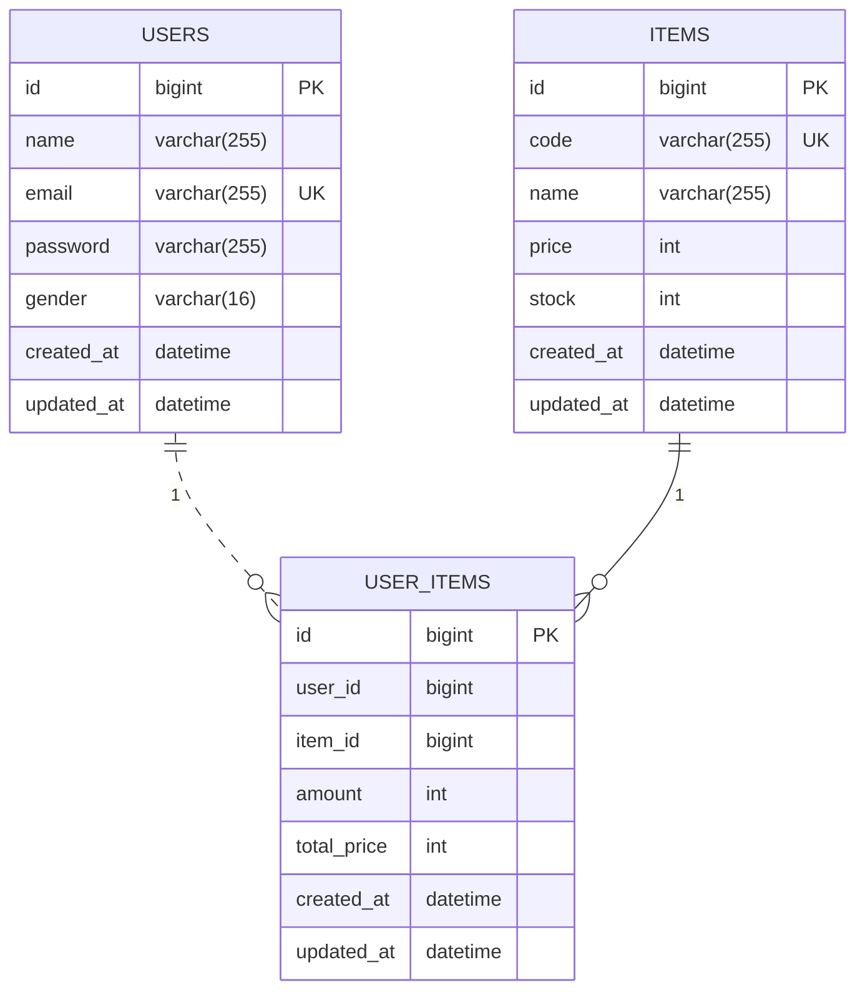

```mermaid
erDiagram
    USERS {
        id bigint PK
        name varchar(255)
        email varchar(255) UK
        password varchar(255)
        gender varchar(16)
        created_at datetime
        updated_at datetime
    }
    ITEMS {
        id bigint PK
        code varchar(255) UK
        name varchar(255)
        price int
        stock int
        created_at datetime
        updated_at datetime
    }
    USER_ITEMS {
        id bigint PK
        user_id bigint
        item_id bigint
        amount int
        total_price int
        created_at datetime
        updated_at datetime
    }
    USERS ||..o{ USER_ITEMS : "1"
    ITEMS ||--o{ USER_ITEMS : "1"
```