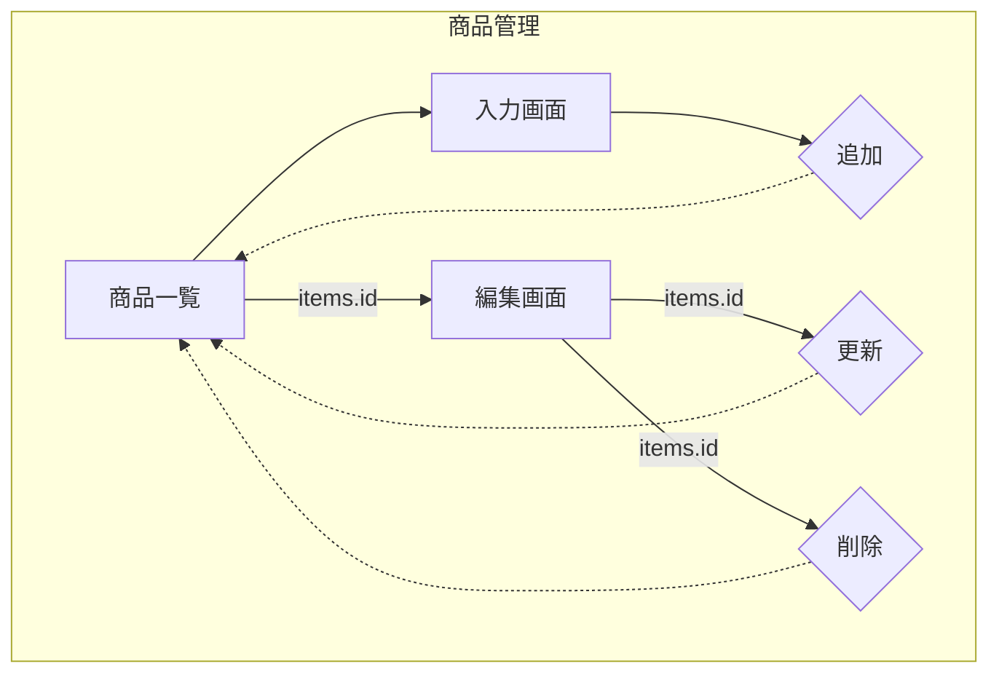

```mermaid
flowchart TD

subgraph 商品管理
list[商品一覧]
input[入力画面]
edit[編集画面]

list-->input-->add{追加}-.->list
list-->|items.id|edit-->|items.id|update{更新}-.->list
edit-->|items.id|delete{削除}-.->list

end
```